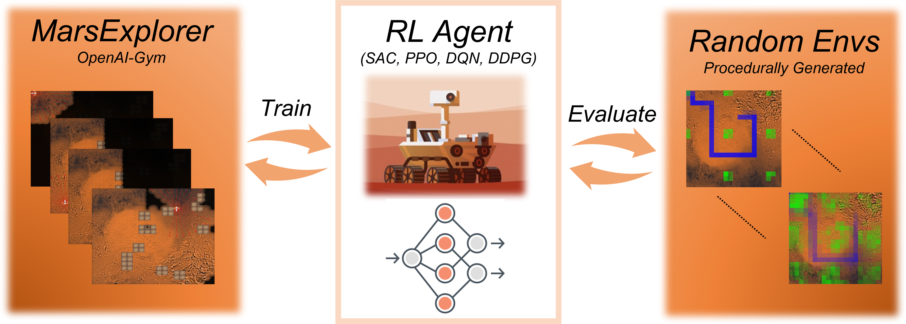

# MarsExplorer



Mars Explorer is an openai-gym compatible environment designed and developed as an initial endeavor to bridge the gap between powerful Deep Reinforcement Learning methodologies and the problem of exploration/coverage of an unknown terrain. For full description and performance analysis, please check out our companion paper [MarsExplorer: Exploration of Unknown Terrains via Deep Reinforcement Learning and Procedurally Generated Environments](https://arxiv.org/abs/2107.09996)

## Achieved Results with PPO-based RL agent


## Strong Generalization is the Key

Terrain diversification is one of the MarsExplorer kye attributes. For each episode, the general dynamics are determined by a specific automated process that has different levels of variation. These levels correspond to the randomness in the number, size, and positioning of obstacles, the terrain scalabality (size), the percentage of the terrain that the robot must explore to consider the problem solved and the bonus reward it will receive in that case. This procedural generation of terrains allows training in multiple/diverse layouts, forcing, ultimately, the RL algorithm to enable generalization capabilities, which are of paramount importance in real-life applicaiton where unforeseen cases may appear.


# Installation

## Quick Start

You can install MarsExplorer environment by using the following command:

```shell
$ git clone https://github.com/dimikout3/GeneralExplorationPolicy.git
$ pip install -e mars-explorer
```

## Full Installation 

If you want you can proceed with a full isntallation, that includes a pre-configured CONDA environment with the Ray/RLlib and all the dependancies. Thereby, enabling a safe and robust pipelining approach to training your own agent on exploration/coverage missions.

```shell
$ sh setup.sh
```

## Dependancies

You can have a better look at the dependencies at:

```shell
setup/environment.yml
```

# Testing

Please run the following command to make sure that everything works as expected:

```shell
$ python mars-explorer/tests/test.py
```

## Manual Control

We have included a manual control of the agent, via the corresponding arrow keys. Run the manual control environment via:

```shell
$ python mars-explorer/tests/manual.py
```

# Execution of Experiments

## Deep Reinforcement Learning Approaches

You can train you own agent by using Ray\RLlib formulation. For a more detailed guidance, have a look at our implementation of a PPO agent in a 21-by-21 terrain:

```shell
$ python trainners/runner.py
```

You can also test multiple implemantations with different agent (e.g SAC, DQN-Rainbow, A3C) by batch training:

```shell
$ python trainners/batch.py
```

By default all of the results, with the saved agents, will be located at:

```shell
$ ~/ray_results
```

## Non-Learning Methodologies

In order to provide a comparison with existing and well-established frontier-based approaches, we have included two different implemantation.

<details>
  <summary><em>Cost-based</em></summary>
  <p>The next action is chosen based on the distance from the nearest frontier cell.</p>
</details>
<details>
  <summary><em>Utility-based</em></summary>
  <p>the dicision-making is governed by a frequently updated information potential field</p>
</details>

Which can be tested by running the corresponding scripts:
```shell
$ python non-learning/frontierCostExploration.py.py
$ python non-learning/frontierUtilityExploration.py.py
```
# Citation
If you find this useful for your research, please use the following:
```
@article{Koutras2021MarsExplorer,
  title={MarsExplorer: Exploration of Unknown Terrains via Deep Reinforcement Learning and Procedurally Generated Environments},
  author={Dimitrios I. Koutras and A. C. Kapoutsis and A. Amanatiadis and E. Kosmatopoulos},
  journal = {arXiv preprint arXiv:2107.09996},
  year={2021}
}
```
